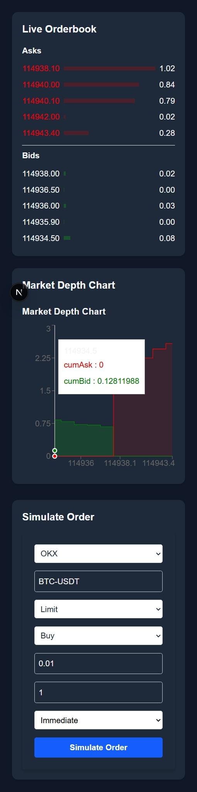

# Real-Time Orderbook Viewer with Order Simulation


## Project Overview

This project visualizes a live cryptocurrency orderbook (bids/asks) for one or more trading venues (e.g., OKX, Bybit, Deribit). It uses WebSocket feeds to show real‐time depth updates and overlays simulated orders (limit or market) so you can see how your trade would interact with the current book.

You can:
- View best bid/ask prices, order sizes, and depth at different price levels.
- Submit a **Limit** or **Market** order via a form.
- See your simulated order “fill” across multiple price levels in real time.
- Configure timing delays (immediate, 5s, 10s, 30s) before order injection.

---

## Key Features

- **Live Data Streaming**  
  Connects to exchange WebSocket APIs for real‐time orderbook updates.
- **Order Simulation**  
  Place limit/market orders against live data without executing on real venues.
- **Customizable Timing**  
  Delay your simulated orders by specified intervals (for testing latency effects).
- **Responsive UI**  
  Auto‐scaling charts & forms, styled with Tailwind CSS.
- **Form Validation**  
  Robust input checking via Zod + React Hook Form.
- **State Management**  
  Lightweight global store using Zustand.
- **Next.js Framework**  
  Fast SSR/SSG, built‐in routing, optimized for production.

---

## Tech Stack

- **Framework:** Next.js (App Router)  
- **Styling:** Tailwind CSS  
- **Charts:** Recharts (AreaChart, DepthGraph)  
- **Forms:** React Hook Form + Zod resolver  
- **State:** Zustand  
- **Language:** TypeScript  
- **WebSockets:** Native browser API / exchange SDKs  
- **Deployment:** Vercel (recommended)

---

## Demo


Responsive Image



---

## Getting Started

### Prerequisites

- Node.js ≥ 18.x  
- npm, yarn, or pnpm  
- A modern browser (Chrome / Firefox)

### Installation

1. **Clone the repo**

   ```bash
   git clone https://github.com/Umang077/Real-Time-Orderbook-Viewer-with-Order-Simulation.git
   cd orderbook-viewer
Install dependencies

bash
Copy
Edit
# npm
npm install

# or yarn
yarn

# or pnpm
pnpm install
Running Locally
Starts the development server:
npm run dev
# or
yarn dev
# or
pnpm dev
Open http://localhost:3000 in your browser.
